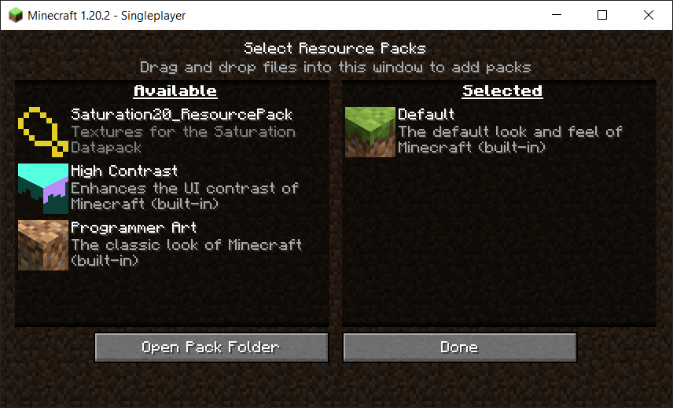
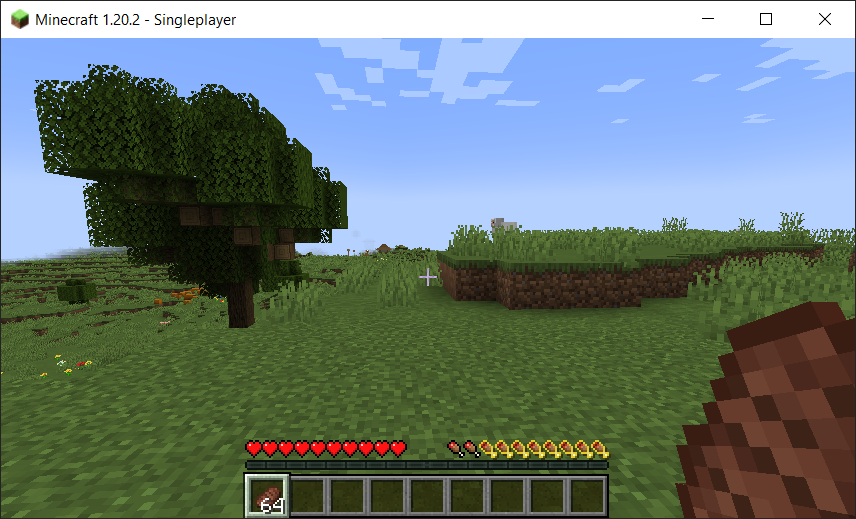

## Overview ##
<b>NOTICE: I AM NOT THE ORIGINAL AUTHOR OF THIS DATAPACK

This datapack was originally created by TheMoneyRaider and posted to PlanetMinecraft on Novemeber 13th 2021</b> 
Original Source: https://www.planetminecraft.com/data-pack/saturation-bar-in-minecraft/

This git repository contains a modified version of TheMoneyRaider's original Saturation Bar Datapack. This version includes fixes and improvements added by MakCuber, and makes the Datapack natively compatibile with Minecraft Java 1.20.2

The changes compared to the original Saturation Bar Datapack include:
- Added a fix for a graphical issue with the positioning of the Saturation Icons resulting from incorrect character offsets in the title actionbar commands
- Added a fix that hides the Saturation Icons when the player is riding a mob (Ex: Horse), since the Hunger Icons are not visible when riding mobs
- The datapack and resource pack versions have been interated to 18 for 1.20.2 compatibility

 

## Installation ##

<b>NOTE: This Datapack must be used with the accompaning Resource Pack (the folder labelled Saturation20_ResourcePack), which has also been updated to the latest datapack version for Minecraft 1.20.2. If the accompaning resource pack is not used, the custom title actionbar will show as the blank unicode characters: <code>[]</code> </b>

### Install in Single Player/Local World ###

1. Download the Saturation20_Datapack and Saturation20_ResourcePack folders from this git repository. You can do this downloading the latest release files (right sidebar) or by clicking the green Code button in the Github respository and selecting the Download ZIP option from the dropdown menu to download a full copy of the repository files.
2. Open your Minecraft World folder, either by navigating to it manually, or from within the Minecraft main menu by selecting the world, clicking the Edit button, then clicking the Open World Folder button

3. In your Minecraft World folder, there should be a folder called "datapacks", copy the Saturation20 folder in its entirity to this "datapacks" folder within your Minecraft World folder
4. Open your Minecraft Resource Pack folder, either by navigating to it manually, or from within the Minecraft Options Menu by clicking the Resource Packs button and then clicking the Open Pack Folder button
5. Copy the Saturation20_ResourcePack folder in its entirety to your local Minecraft Resource Pack folder
6. The Resource Pack should now be visible in the Minecraft Resource Pack menu. 

7. Hover the mouse cursor over the Saturation20_ResourcePack icon on the left section and click on the Arrow icon that appears to Enable the Resource Pack

8. Open your Minecraft World and you should now see the Saturation Bar overlayed on top of the Hunger Bar

### Install on Server World ###

1. Download the Saturation20 folder from this git repository. You can do this by clicking the green Code button and selecting the Download ZIP option from the dropdown menu.
2. Ensure that your Minecraft Server is not running 
 
NOTE: While you can technically use the /reload command after installing the datapack instead of restarting the server, this is not recommended if you are running a modded server such as bukit or spigot, restarting the server is safer.

3. Copy the Saturation20 folder in its entirety to the "datapacks" folder within your Minecraft Server's world folder (create the datapacks folder if it doesnt exist). The world folder which will be named with whatever world name you've configured in your server.properties file.
 
NOTE: This only needs to be done for the primary world folder, it is not required for the `world_nether` and `world_the_end` world folders.

4. Edit your server.properties file found inside your Minecraft Server folder, and add the following URL to the `resource-pack=` line:  
`https\://download.mc-packs.net/pack/df7a57a5230a88131f7db0fb304374e5a62bd88f.zip` 
IMPORTANT: The colon character `:` in the URL above must be escape with the proceeding backslash character `\`, without this the Minecraft Server will not be able to read the URL correctly

5. Ensure the changes to your server.properties file are saved then restart your Minecraft Server
6. Connect to your Minecraft Server and accept the Resouce Pack

### Missing Resource Pack Error ###

<b>This Datapack must be used with the accompaning Resource Pack (the folder labelled Saturation20_ResourcePack), which has also been updated to the latest datapack version for Minecraft 1.20.2. If the accompaning resource pack is not used, the custom title actionbar will show a Title of blank unicode characters:  
Example: `[][][][][][][][][][][][][][][][][][][][][][][]` </b>

 

## Details on how this Datapack works ##
This Datapack adds an overlay to the Hunger Bar to show the players Saturation level.
This is achived by creating a custom actionbar title where the characters in the title text are the custom Saturation Overlay Icons.

The Saturation Icons are implemented as a custom font, and are assigned to unicode IDs in the private unicode namespace (Ex: \uE000 is assigned to Full Stauration Icon png). The spacing between icons and from the starting of the title text is facilitated by an array of blank icons of different pixel sizes
By chaining these different sized blank icons together a specific pixel spacing can be set within the title text between each Saturation Icon

### Fix added to hide Saturation Icons when player is riding a mob ###
To hide the Saturation Icons when a player is riding, each execute command in the display.mcfunction file now includes an "unless" section
to run a data which checks if the target entity has the RootVehicle NBT tag, which denotes that the entity is riding onto of another entity.

<h3>Fixes to Actionbar Title Spacing</h3>
The original Datapack (created for 1.17) had incosistent spacing when used in Minecraft version 1.20 or newer. This caused the Saturation Icons to be shifted to the right and be out of alignment with the Hunger Icons they were supposed to overlay.

 
After manually deciphering the spacing used originally, it was clear that something had changed since 1.17 such that the varied spacing was no longer needed. Changing the spacing to the default space used when saturation is full and empty (97 pixels), completely fixed the graphical alignment issue.

 
This issue appears to be due to changes made to the title command in Minecraft sometime around the release of 1.19.4, though it is unclear exactly what change causes the original spacing formatting to break in versions 1.20 and newer

With this spacing change, there is technically no longer a need for all the other custom blank icon png files that are not used for the default spacing. However, in case an issue like this occurs again in any future updates, the other custom spacing png files have been left intact and the original spacing recorded below.

#### Details used for troubleshooting the character offset ####

NOTE: The unicode characters referenced below are defined in the file:<code> /Saturation20_Textures/assets/minecraft/font/default.json </code>

No Icon (9px-4px=5px) 
Half Icon (9-4=5) 
Full Icon (9-4=5)

    "\uE000\uF802" >> Sat1 + Space >> Full Saturation Icon 
    "\uE001\uF802" >> Sat2 + Space >> Half Saturation Icon 
    "\uE002\uF802" >> Sat3 + Space >> Null Saturation Icon 
    \uE000 >> minecraft:custom/saturation.png a=-26 h=9 >> Full Saturation Icon 
    \uE001 >> minecraft:custom/saturation2.png a=-26 h=9 >> Half Saturation Icon 
    \uE002 >> minecraft:custom/saturation3.png a=-26 h=9 >> Null Saturation Icon

    "\uE000\uF802" >> Sat1 + Space >> Full Saturation Icon 
    "\uE001\uF802" >> Sat2 + Space >> Half Saturation Icon 
    "\uE002\uF802" >> Sat3 + Space >> Null Saturation Icon 
    \uE000 >> minecraft:custom/saturation.png a=-26 h=9 >> Full Saturation Icon 
    \uE001 >> minecraft:custom/saturation2.png a=-26 h=9 >> Half Saturation Icon 
    \uE002 >> minecraft:custom/saturation3.png a=-26 h=9 >> Null Saturation Icon 

#### Orignal Spacing ####

    Saturation 20 (Full Icon): "\uF82B\uF82A\uF824" >> space(63) + space(31) + space(3) = 97 pixels, 0 from default
    Saturation 19 (Half Icon): "\uF82B\uF82A\uF824" >> space(63) + space(31) + space(3) = 97 pixels, 0 from default

    Saturation 18 (Full Icon): "\uF82B\uF82A\uF829\uF804" >> space(63) + space(31) + space(15) + space(-6) = 103 pixels, 6 from default (103-97), 6 from previous (103-97)
    Saturation 17 (Half Icon): "\uF82B\uF82A\uF829\uF804" >> space(63) + space(31) + space(15) + space(-6) = 103 pixels, 6 from default (103-97), 6 from previous (103-97)

    Saturation 16 (Full Icon): "\uF82B\uF82A\uF829\uF825" >> space(63) + space(31) + space(15) + space(4) = 113 pixels, 16 from default (113-97), 10 from previous (113-103)
    Saturation 15 (Half Icon): "\uF82B\uF82A\uF829\uF825" >> space(63) + space(31) + space(15) + space(4) = 113 pixels, 16 from default (113-97), 10 from previous (113-103)

    Saturation 14 (Full Icon): "\uF82C\uF802" >> space(127) + space(-4) = 123 pixels, 26 from default (123-97), 10 from previous (123-113)
    Saturation 13 (Half Icon): "\uF82C\uF802" >> space(127) + space(-4) = 123 pixels, 26 from default (123-97), 10 from previous (123-113)

    Saturation 12 (Full Icon): "\uF82C\uF828" >> space127 + space7 = 134 pixels, 37 from default (134-97), 11 from previous (134-123)
    Saturation 11 (Half Icon): "\uF82C\uF829\uF808" >> space127 + space31 + space-10 = 148 pixels, 51 from default (148-97), 14 from previous (148-134)

    Saturation 10 (Full Icon): "\uF82C\uF829" >> space127 + space15 = 142 pixels, 45 from default (142-97), 8 from previous (142-134)
    Saturation 09 (Half Icon): "\uF82C\uF829" >> space127 + space15 = 142 pixels, 45 from default (142-97), 8 from previous (142-134)

    Saturation 08 (Full Icon): "\uF82C\uF829\uF829\uF806" >> space127 + space15 + space15 +space-8 = 149 pixels, 52 from default (149-97), 7 from previous (149-142)
    Saturation 07 (Half Icon): "\uF82C\uF829\uF829\uF806" >> space127 + space15 + space15 +space-8 = 149 pixels, 52 from default (149-97), 7 from previous (149-142)

    Saturation 06 (Full Icon): "\uF82C\uF82A\uF822" >> space127 + space31 + space1 = 159 pixels, 62 from default (159-97), 10 from previous (159-149)
    Saturation 05 (Half Icon): "\uF82C\uF82A\uF822" >> space127 + space31 + space1 = 159 pixels, 62 from default (159-97), 10 from previous (159-149)

    Saturation 04 (Full Icon): "\uF82C\uF82A\uF829\uF804" >> space127 + space31 + space15 + space-6 = 167 pixels, 70 from default (167-97), 8 from previous (167-159)
    Saturation 03 (Half Icon): "\uF82C\uF82A\uF829\uF804" >> space127 + space31 + space15 + space-6 = 167 pixels, 70 from default (167-97), 8 from previous (167-159)

    Saturation 02 (Full Icon): "\uF82C\uF82A\uF82A\uF824\uF809" >> space(127) + space(31) + space(3) + space(-18) = 143 pixels, 46px from default (143-97), 26px from previous (143-167)
    Saturation 01 (Half Icon): "\uF82C\uF82A\uF82A\uF824\uF809" >> space127 + space31 + space3 + space-18 = 143 pixels, 46 from default (143-97), -26 from previous (143-167)

    Saturation 00 (No Icon): "\uF82B\uF82A\uF824" >> space63 + space31 + space3 = 97 pixels, 0 from default

### Useful Links ###
- [Reddit Thread outlining how to write commands that target players riding a horse](https://www.reddit.com/r/MinecraftCommands/comments/ep0ug7/how_to_target_a_player_riding_a_horse/)
- [Reddit Thread outlining bitmap png files are used for custom fonts in datapacks](https://www.reddit.com/r/mcresourcepack/comments/wpcg0a/hi_i_want_to_learn_what_does_the_ascent_and_chars/)
- [Minecraft.Wiki Guide detailing the Title command](https://minecraft.wiki/w/Commands/title)
 
 
- [Minecraft.Wiki Guide for installing Datapacks](https://minecraft.wiki/w/Tutorials/Installing_a_data_pack)
- [Minecraft.Wiki Guide for installing Resource Packs](https://minecraft.wiki/w/Tutorials/Loading_a_resource_pack)
 
 
- [Minecraft.Wiki Datapack Version List](https://minecraft.wiki/w/Pack_format#List_of_data_pack_formats)
- [Minecraft.Wiki Resource Pack Version List](https://minecraft.wiki/w/Pack_format#List_of_resource_pack_formats)
 
 
- [Minecraft.Wiki Guide outlining Datapack formatting](https://minecraft.wiki/w/Data_pack)
- [Minecraft.Wiki Guide outlining Resource Pack formatting](https://minecraft.wiki/w/Resource_pack)
